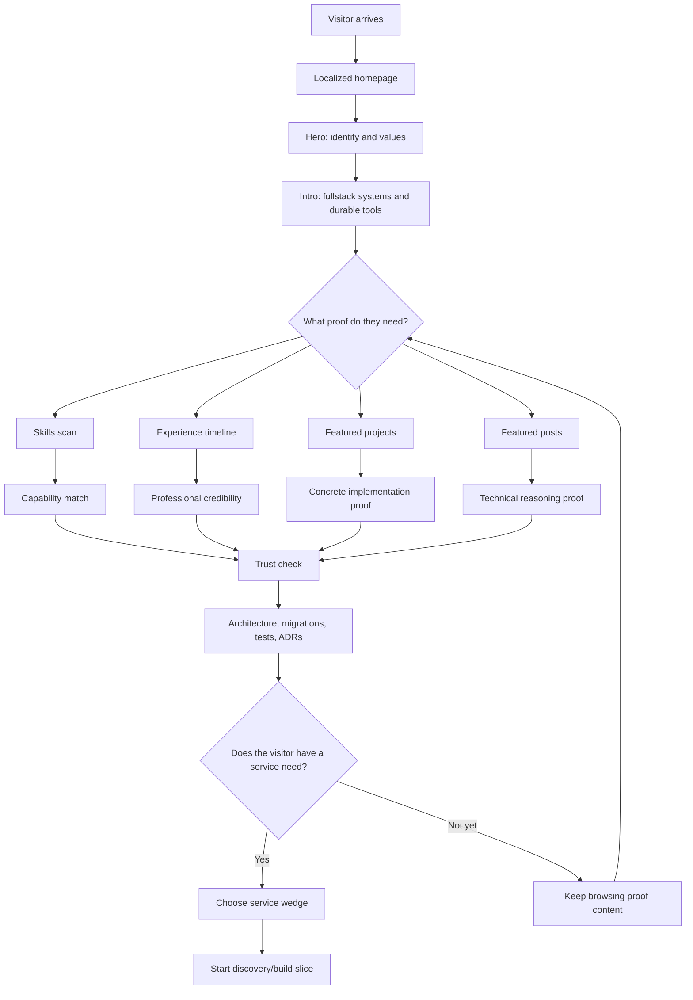

# PF-DIAG-001 - Visitor Discovery Journey

Status: Draft source  
Owner: Thouzands  
Last updated: 2026-06-29  
Target home: FigJam and Confluence

## Purpose

Show how a potential client or reviewer moves from first impression to service-specific action.

Source docs:

- `analysis/product/problem-statement.md`
- `analysis/product/positioning-brief.md`
- `analysis/product/content-strategy.md`
- `analysis/product/conversion-path.md`

## Mermaid Source

## FigJam Notes

- Use swimlanes for visitor thought, portfolio surface, and proof artifact.
- Mark the current product gap at the final action path.
- Link service wedges to `analysis/product/conversion-path.md`.

## Update Trigger

Update when homepage order, service wedges, proof surfaces, or contact/intake behavior changes.

