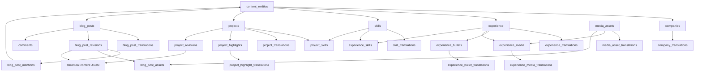

# PF-DIAG-002 - Portfolio Content Model

Status: Draft source  
Owner: Thouzands  
Last updated: 2026-06-29  
Target home: FigJam and Confluence

## Purpose

Show the CMS content model at a readable product/technical level without requiring reviewers to inspect every table in
`src/db/schema.ts`.

Source docs:

- `analysis/technical/schema-and-migrations.md`
- `analysis/technical/adr/0002-use-drizzle-schema-and-migrations.md`
- `analysis/technical/adr/0003-use-structural-content-json.md`
- `src/db/schema.ts`

## Mermaid Source

## FigJam Notes

- Group entities by domain: identity, portfolio proof, blog, media, revisions, interaction.
- Show translation tables as secondary nodes around their parent content.
- Keep comments visually separate from CMS authoring content.

## Update Trigger

Update after major schema changes, new content relationships, or migration groups that change product meaning.

