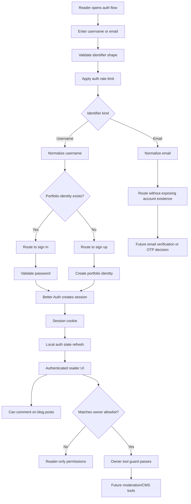

# PF-DIAG-003 - Auth Identifier And Session Flow

Status: Draft source  
Owner: Thouzands  
Last updated: 2026-06-29  
Target home: FigJam and Confluence

## Purpose

Show how the portfolio-specific identifier flow relates to Better Auth session behavior.

Source docs:

- `src/auth/auth.md`
- `analysis/technical/adr/0004-separate-portfolio-identity-from-auth-provider-records.md`
- `analysis/technical/adr/0010-use-explicit-owner-allowlist-for-protected-tools.md`
- `analysis/product/interaction-policy.md`
- `analysis/jira/user-stories.md`

## Mermaid Source

## FigJam Notes

- Use separate colors for portfolio-owned identity decisions and Better Auth-owned session behavior.
- Mark email OTP as future/decision territory.
- Link rate limiting to security requirements `NFR-003` and `NFR-004`.
- Link owner-only path to ADR 0010, `FR-020`, and `PF-409`.

## Update Trigger

Update when identifier routing, signup/signin actions, Better Auth configuration, session refresh behavior, or owner
authorization changes.
