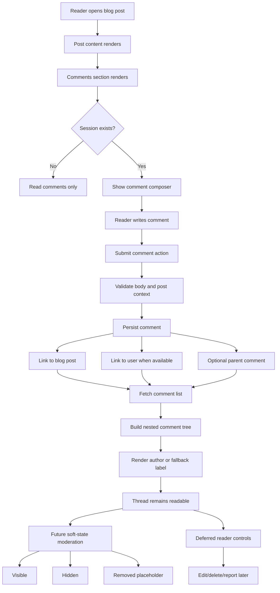

# PF-DIAG-004 - Blog Comment Flow

Status: Draft source  
Owner: Thouzands  
Last updated: 2026-06-29  
Target home: FigJam and Confluence

## Purpose

Show how account-backed blog comments move from page rendering through submission, persistence, nested rendering, and
future moderation.

Source docs:

- `analysis/product/interaction-policy.md`
- `analysis/technical/adr/0005-preserve-comments-after-user-deletion.md`
- `analysis/technical/adr/0009-use-soft-state-comment-moderation.md`
- `analysis/jira/user-stories.md`
- `src/blog/actions.ts`
- `tests/blog/comments.test.ts`

## Mermaid Source

## FigJam Notes

- Show current behavior and future moderation in separate visual zones.
- Mark account deletion as a preservation path, not a deletion path.
- Link future soft states to ADR 0009, `PF-406`, and `PF-407`.
- Keep reader edit, delete, and report controls visually separate as deferred `PF-408` scope.

## Update Trigger

Update when comment action behavior, moderation schema, rendering states, edit/delete rules, or reporting behavior
changes.
