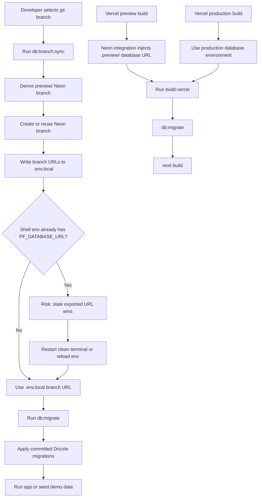

# PF-DIAG-005 - Deployment And Neon Branch Workflow

Status: Draft source  
Owner: Thouzands  
Last updated: 2026-06-29  
Target home: FigJam and Confluence

## Purpose

Show how local and Vercel workflows should apply Drizzle migrations against the intended Neon database branch, with
feature-branch development sharing the `preview/<git-branch>` Neon branch used by Vercel preview deployments.

Source docs:

- `README.md`
- `src/db/db.md`
- `analysis/technical/schema-and-migrations.md`
- `analysis/technical/adr/0002-use-drizzle-schema-and-migrations.md`
- `scripts/sync-neon-branch.mjs`

## Mermaid Source

## FigJam Notes

- Use separate lanes for local developer workflow, Vercel preview deployment workflow, and production deployment
  workflow.
- Emphasize the stale environment variable warning.
- Link migration ownership to ADR 0002.

## Update Trigger

Update when Neon branch sync, Vercel build scripts, environment variable names, or migration commands change.
