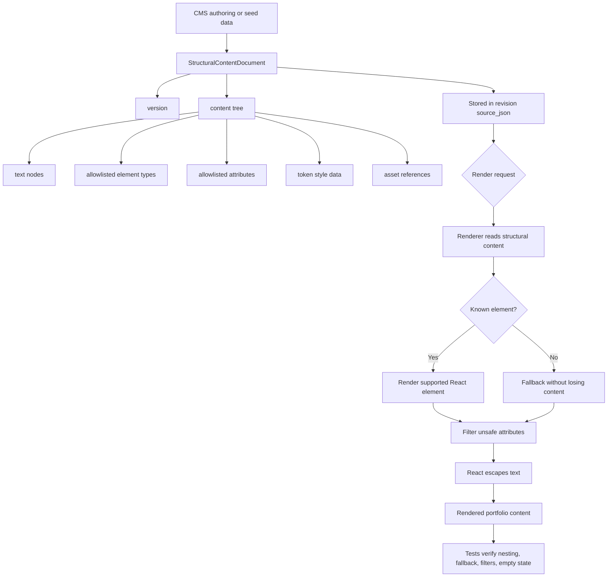

# PF-DIAG-006 - Structural Content Rendering Contract

Status: Draft source  
Owner: Thouzands  
Last updated: 2026-06-29  
Target home: FigJam and Confluence

## Purpose

Show how stored structural content becomes rendered output without storing or trusting raw HTML.

Source docs:

- `analysis/technical/adr/0003-use-structural-content-json.md`
- `src/cms/structural-content/types.ts`
- `src/components/repeatables/structural-content`
- `tests/structural-content/rendering.test.ts`

## Mermaid Source

## FigJam Notes

- Separate storage contract, rendering boundary, and test coverage.
- Mark raw HTML as intentionally absent from the main path.
- Link schema version changes to future migration policy.

## Update Trigger

Update when structural schema version, supported elements, attribute filtering, asset handling, or renderer fallback
behavior changes.

