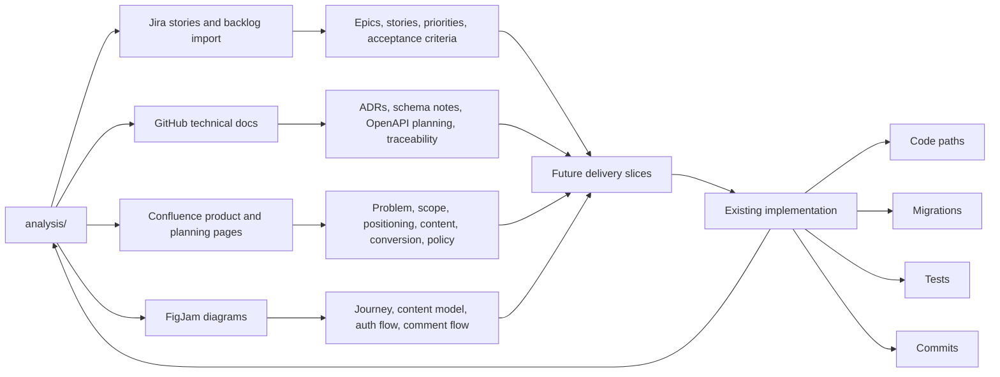

# PF-DIAG-007 - Documentation Toolchain

Status: Draft source  
Owner: Thouzands  
Last updated: 2026-06-29  
Target home: FigJam and Confluence

## Purpose

Show how local Git-tracked analysis feeds Confluence, Jira, FigJam, and GitHub technical artifacts.

Source docs:

- `analysis/README.md`
- `analysis/confluence/page-tree.md`
- `analysis/jira/project-setup.md`
- `analysis/design/diagram-inventory.md`
- `analysis/github/documentation-rules.md`

## Mermaid Source

## FigJam Notes

- Put `analysis/` in the center as the local starting point.
- Show GitHub as authoritative for ADRs, schema, and API contracts.
- Show Jira as execution state, not full narrative context.
- Show Confluence as the readable product/business home.

## Update Trigger

Update when the source-of-truth rules change or connected Confluence/Jira/FigJam workflows are established.

