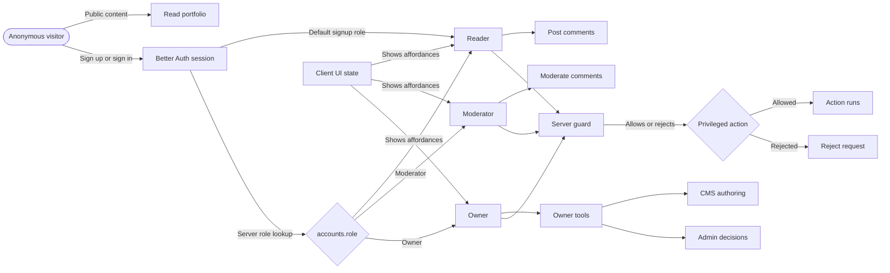

# PF-DIAG-008 - User Role Authorization Model

Status: Draft source  
Owner: Thouzands  
Last updated: 2026-07-03
Target home: FigJam and Confluence

## Purpose

Show the Reader, Moderator, and Owner role vocabulary now stored on the centralized account row. The diagram keeps
role-driven UI affordances separate from server-authoritative authorization checks.

Source docs:

- `analysis/product/auth-account-roadmap.md`
- `analysis/technical/adr/0010-use-explicit-owner-allowlist-for-protected-tools.md`
- `analysis/jira/user-stories.md`
- `KAN-56`

## Mermaid Source

## FigJam Notes

- FigJam section: `PF-DIAG-008 - User Role Authorization Model`.
- Section URL: `https://www.figma.com/board/s6bFSjN2FQ0mTvs75itGkW/Portfolio-Analysis-Diagrams?node-id=25-841`.
- Generated shapes and connectors remain page-level for connector-routing safety; the section is a visible grouping
  label.
- Role storage and shared server helper implementation started in `PF-412`; privileged moderation/CMS actions still
  need to adopt the helpers before UI controls are exposed.

## Update Trigger

Update when role names, role storage, authorization guards, moderation capabilities, owner tools, or CMS authoring
privilege boundaries change.
