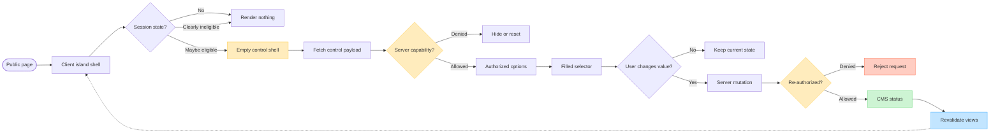

# PF-DIAG-009 - Permission-Gated Reactive Island Flow

Status: Draft source
Owner: Thouzands
Last updated: 2026-07-01
Target home: FigJam and Confluence

## Purpose

Show how a privileged UI island can render as a fast shell while all privileged data and mutations remain
server-authorized. The example centers on a post status selector, but the pattern is intended for moderation and future
owner/CMS controls as well.

Source docs:

- `analysis/technical/permission-gated-reactive-islands.md`
- `analysis/product/auth-account-roadmap.md`
- `analysis/jira/user-stories.md`
- `PF-413` / `KAN-57`
- `PF-412` / `KAN-56`

## Mermaid Source

## FigJam Notes

- FigJam section: `PF-DIAG-009 - Permission-Gated Reactive Island Flow`.
- Section URL: `https://www.figma.com/board/s6bFSjN2FQ0mTvs75itGkW/Portfolio-Analysis-Diagrams?node-id=27-929`.
- Generated shapes and connectors should remain page-level for connector-routing safety; the section should be a visible
  grouping label.
- The diagram links back to `PF-413` / `KAN-57` and `KAN-56`.

## Update Trigger

Update when the permission island gate, capability payload endpoint, post-status selector, mutation authorization, or
role/capability vocabulary changes.
